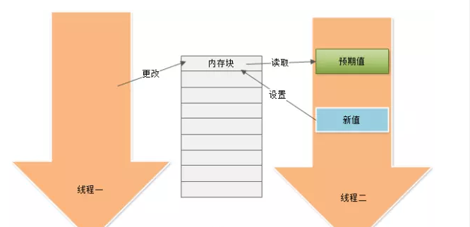

### CAS（Compare and Swap）


##### 悲观与乐观

悲观者与乐观者的做事方式完全不一样，悲观者的人生观是一件事情我必须要百分之百完全控制才会去做，否则就认为这件事情一定会出问题；而乐观者的人生观则相反，凡事不管最终结果如何，他都会先尝试去做，大不了最后不成功。

悲观锁会把整个对象加锁占为自有后才去做操作，乐观锁不获取锁直接做操作，然后通过一定检测手段决定是否更新数据。


##### 内存值、预期值、新值



当且仅当预期值和内存值相等时才将内存值修改为新值

```java
public class AtomicInt {
    private volatile int value; 
    public final int get() {
        return value;
    }
	
	public final int getAndIncrement() {
        for (;;) {
            int current = get();
            int next = current + 1;
            if (compareAndSet(current, next))
                return current;
        }
    }
    
    public final boolean compareAndSet(int expect, int update) {
		Unsafe类提供的硬件级别的compareAndSwapInt方法;
    }
}

```

##### 优缺点

优点 避免悲观锁独占对象，提高了并发性能

缺点 

1.悲观锁只能保证一个共享变量的原子操作，但互斥锁能轻易解决，不管对象数量多少及对象颗粒度大小。

2.长时间自旋可能导致开销大。假如CAS长时间不成功而一直自旋，会给CPU带来很大的开销。

3.ABA问题。CAS的核心思想是通过比对内存值与预期值是否一样而判断内存值是否被改过，但这个判断逻辑不严谨，假如内存值原来是A，后来被一条线程改为B，最后又被改成了A，则CAS认为此内存值并没有发生改变，但实际上是有被其他线程改过的，这种情况对依赖过程值的情景的运算结果影响很大。解决的思路是引入版本号，每次变量更新都把版本号加一。

进阶

https://blog.csdn.net/chenssy/article/details/69640293

解答这个问题

https://www.zhihu.com/question/65372648