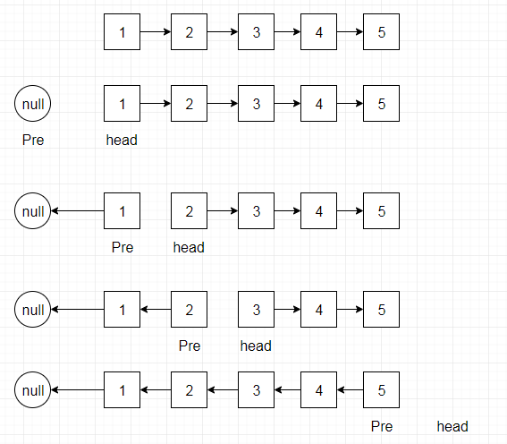

## 链表倒置

只需要两个指针来操作。同时一个临时变量还保存下一个节点，然后平移两个指针,直到head为null。




```java
/**
 * Definition for singly-linked list.
 * public class ListNode {
 *     int val;
 *     ListNode next;
 *     ListNode(int x) { val = x; }
 * }
 */
class Solution {

    
     public ListNode reverseList(ListNode head) {
        ListNode newHead = null;
         while(head != null){
           ListNode  t = head.next;
             head.next = newHead;
             newHead = head;
             head = t;
         }
         
         return newHead;
       
    }
   
}
```


