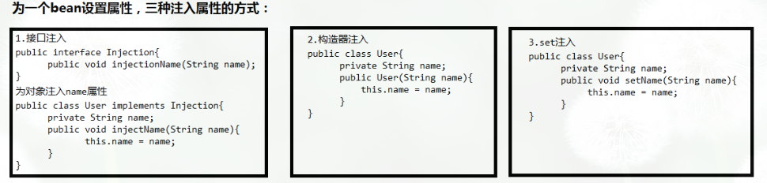

### spring面试1

http://www.importnew.com/19538.html

https://www.cnblogs.com/wang-meng/p/5701982.html

https://juejin.im/post/5b065000f265da0de45235e6

http://www.importnew.com/15851.html

####  谈谈你对spring IOC和DI的理解，它们有什么区别？

IoC Inverse of Control 反转控制的概念，就是将原本在程序中手动创建UserService对象的控制权，交由Spring框架管理，简单说，就是创建UserService对象控制权被反转到了Spring容器

DI：Dependency Injection 依赖注入，在Spring框架负责创建Bean对象时，动态的将依赖对象注入到Bean组件

**本质上是描述一件事情的不同方面**

#### 使用Spring框架的好处是什么？

  包括但不限于

- **轻量：**Spring 是轻量的，相对于EJB而言，spring-bean 几MB。

- **控制反转：**Spring通过控制反转实现了松散耦合，对象们给出它们的依赖，而不是创建或查找依赖的对象们。

- **面向切面的编程(AOP)：**Spring支持面向切面的编程，并且把应用业务逻辑和系统服务分开。+++

- **容器：**Spring 包含并管理应用中对象的生命周期和配置。+++

- **MVC框架**：Spring的WEB框架是个精心设计的框架，是Web框架的一个很好的替代品。+++

- **事务管理：**Spring 提供一个持续的事务管理接口，可以扩展到上至本地事务下至全局事务（JTA）。+++

- **异常处理：**Spring 提供方便的API把具体技术相关的异常（比如由JDBC，Hibernate or JDO抛出的）转化为一致的unchecked 异常。+++

#### Spring由哪些模块组成?

  需再看spring不同的项目具体的作用


#### BeanFactory 接口和 ApplicationContext 接口有什么区别 ？
ApplicationContext 接口继承BeanFactory接口，Spring核心工厂是BeanFactory ,BeanFactory采取延迟加载，第一次getBean时才会初始化Bean, ApplicationContext是会在加载配置文件时初始化Bean。
​    ②ApplicationContext是对BeanFactory扩展，它可以进行国际化处理、事件传递和bean自动装配以及各种不同应用层的Context实现 
开发中基本都在使用ApplicationContext, web项目使用WebApplicationContext ，很少用到BeanFactory
```java
BeanFactory beanFactory = new XmlBeanFactory(new ClassPathResource("applicationContext.xml"));
IHelloService helloService = (IHelloService) beanFactory.getBean("helloService");
helloService.sayHello();
```

####  核心容器（应用上下文) 模块

  这是基本的Spring模块，提供spring 框架的基础功能，BeanFactory 是 任何以spring为基础的应用的核心。Spring 框架建立在此模块之上，它使Spring成为一个容器。ApplicationContext？

#### BeanFactory – BeanFactory 实现举例[spring 设计模式]。

  Bean 工厂是工厂模式的一个实现，提供了控制反转功能，用来把应用的配置和依赖从正真的应用代码中分离。
最常用的BeanFactory 实现是XmlBeanFactory 类。

#### XMLBeanFactory 
  补充


####  Bean注入属性有哪几种方式？



spring支持构造器注入和setter方法注入

​    构造器注入，通过 <constructor-arg> 元素完成注入

​    setter方法注入， 通过<property> 元素完成注入【开发中常用方式】


####  Spring Bean的作用域之间有什么区别？

Spring容器中的bean可以分为5个范围。所有范围的名称都是自说明的，但是为了避免混淆，还是让我们来解释一下：

1. singleton：这种bean范围是默认的，这种范围确保不管接受到多少个请求，每个容器中只有一个bean的实例，单例的模式由bean factory自身来维护。
2. prototype：原形范围与单例范围相反，为每一个bean请求提供一个实例。
3. request：在请求bean范围内会每一个来自客户端的网络请求创建一个实例，在请求完成以后，bean会失效并被垃圾回收器回收。
4. Session：与请求范围类似，确保每个session中有一个bean的实例，在session过期后，bean会随之失效。**+++测试**
5. global-session：global-session和Portlet应用相关。当你的应用部署在Portlet容器中工作时，它包含很多portlet。如果你想要声明让所有的portlet共用全局的存储变量的话，那么这全局变量需要存储在global-session中。**+++测试**

全局作用域与Servlet中的session作用域效果相同。

https://gaddma.iteye.com/blog/2037038

https://blog.csdn.net/icarus_wang/article/details/51586776

**更多内容请参考 :** [Spring Bean Scopes](http://howtodoinjava.com/2013/05/07/spring-bean-scopes/)。


.